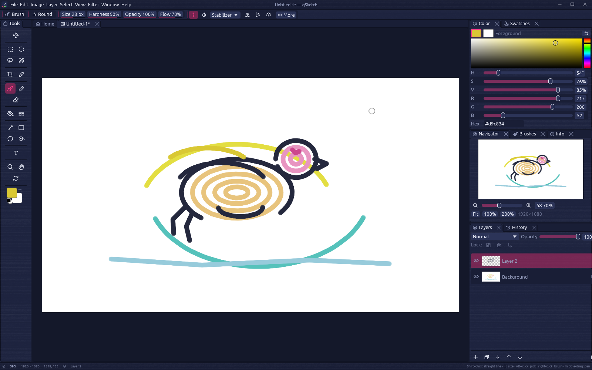

# qsketch

A fast, professional sketching and raster painting desktop app. qsketch gives
you a Photoshop/Aseprite-familiar workflow — layers, blend modes, a
non-destructive undo history, dockable panels — built from scratch in Rust on
top of `egui` and `wgpu` so strokes stay responsive even on large canvases,
with full stylus pressure support via Windows Ink and a fully remappable
keyboard.



## Features

- **Tiled, copy-on-write raster engine.** Layers are stored as 64x64 tiles
  behind `Arc`s, so undo snapshots are cheap and only the tiles a stroke
  actually touches are ever duplicated in memory.
- **Photoshop-style brush engine.** Separate flow (per-dab deposit) and
  opacity (per-stroke cap), a per-stroke coverage buffer so overlapping dabs
  never exceed the opacity ceiling, pressure-to-size and pressure-to-opacity
  curves, and thirteen built-in presets (Hard Round, Soft Round, Pencil, Ink
  Pen, Airbrush, Marker, Pixel, Chalk, Charcoal, Spatter, Scatter Leaves,
  Flat Marker, Dry Bristle). Import brush tips from PNGs or from GIMP
  (`.gbr`, `.gih`) and Photoshop (`.abr`, sampled brushes) files, or drop
  your own texture PNGs into the config folder's `textures/` directory.
- **Photoshop `.psd` open and save** (8/16-bit RGB or grayscale; layer names,
  visibility, opacity, blend modes and clipping round-trip; groups flatten
  into the layer list on open).
- **20 blend modes** (Normal through Luminosity, matching the W3C compositing
  spec / Photoshop semantics), per-layer opacity, clipping masks, alpha lock,
  layer groups (nested, with their own opacity/blend/visibility), and
  merge-down/merge-visible/flatten.
- **A real selection system.** Rectangle, ellipse, lasso and magic-wand
  selections with add/subtract/intersect modifiers, anti-aliased edges,
  marching-ants outlines, and move/lift/drop of floating selections.
- **A Filter menu with live preview.** 43 filters in Photoshop's groups
  (Blur, Distort, Noise, Pixelate, Render, Sharpen, Stylize, Other) plus an
  Experimental set (Outline, Glow, Vignette, Pencil Sketch, Dither,
  Kaleidoscope, Chromatic Aberration, Scanlines, Pixel Sort, Glitch). They
  respect the selection and alpha lock, run in premultiplied color so
  transparent edges stay clean, and `Ctrl+F` repeats the last one.
- **Symmetry painting and stroke stabilizers.** Mirror strokes horizontally,
  vertically or radially (up to 64 copies) around a movable center with
  on-canvas guides, and steady shaky lines with a rope ("lazy brush") or
  moving-average stabilizer per brush.
- **Crash recovery.** Unsaved documents are autosaved to the settings folder
  on a timer and offered for recovery on the next launch if qsketch didn't
  exit cleanly.
- **GPU-accelerated canvas.** A `wgpu` compositor re-uploads only the dirty
  64x64 tiles of the premultiplied composite each frame, drawn over a
  checkerboard with an optional pixel grid at high zoom.
- **Stylus pressure out of the box**, via native pen/touch events or the
  optional `octotablet` backend (Windows Ink RealTimeStylus / Wayland
  tablet-v2) for tilt and eraser-tip detection.
- **A dockable, modern UI** (`egui_dock`): drag, split, float and re-arrange
  the Tools, Layers, History, Color, Swatches, Navigator, Brushes and Info
  panels however you like; the layout is remembered between sessions.
- **Every command is remappable.** All menu commands and tool shortcuts live
  in one keymap you can rebind from Edit ▸ Preferences ▸ Keyboard Shortcuts;
  see [`docs/SHORTCUTS.md`](docs/SHORTCUTS.md) for the defaults.
- **A native, inspectable file format.** `.qsk` is a plain ZIP of PNGs plus a
  JSON manifest — see [`docs/FILE_FORMAT.md`](docs/FILE_FORMAT.md).

## Install

### Windows

Download the latest installer (`qsketch-<version>-setup.exe`) or portable ZIP
(`qsketch-<version>-windows-portable.zip`) from the
[Releases](https://github.com/Cabbit-Labs/qsketch/releases) page. The
installer adds a Start Menu entry, an optional desktop shortcut, and a `.qsk`
file association; the portable ZIP just needs unzipping and can be run from
anywhere (settings still go to the per-user config directory below).

### Linux

Grab the `qsketch-<version>-linux-x86_64.tar.gz` tarball from Releases. It
contains the binary, licenses, a freedesktop.org `.desktop` entry and icons
under `share/`, plus an `install.sh` that copies everything into
`~/.local` (or a prefix you pass as its first argument):

```sh
tar xzf qsketch-*-linux-x86_64.tar.gz
cd qsketch-*-linux-x86_64
./install.sh          # installs into ~/.local by default
```

### Updates

qsketch can update itself from a signed manifest, but it ships without a
manifest URL: enter the one your build's distributor gives you under
Preferences ▸ General ▸ Updates (Help ▸ Check for Updates… opens that page
while it is empty). Once set, qsketch checks it on startup (at most every 6
hours) and on demand; if a newer release exists it offers to download it,
verifies the minisign signature, then installs and relaunches: on Windows by
running the installer silently, on Linux by replacing the running executable
with the one from the tarball (so the install location must be writable by
you, as `install.sh` sets up). The same page has the check interval and a
way to skip a version. Without a URL, grab new versions from the Releases
page. Maintainers publish to their own update channel with
`scripts/release.sh`; see [`docs/RELEASING.md`](docs/RELEASING.md).

### Build from source

```sh
git clone https://github.com/Cabbit-Labs/qsketch.git
cd qsketch
cargo run --release -p qsketch
```

**Linux build dependencies** (Debian/Ubuntu package names; `eframe`/`wgpu`
need a windowing toolkit at build time):

```sh
sudo apt-get install libgtk-3-dev libxkbcommon-dev libwayland-dev libx11-dev pkg-config
```

**Windows:** build natively with the MSVC toolchain (`rustup target add
x86_64-pc-windows-msvc`, then `cargo build --release -p qsketch`), or
cross-compile from Linux with `scripts/build-windows.sh`, which builds against
the `x86_64-pc-windows-gnu` target via mingw-w64 and packages both an NSIS
installer and a portable ZIP under `dist/` (requires
`x86_64-w64-mingw32-gcc`/`windres` and `makensis` on `PATH`).

## Quick start

qsketch opens to a **Home** tab; create a new document or open a `.qsk`/image
file to get a document tab alongside it. The default layout has:

- A **Tools** strip on the left (selection, crop, eyedropper, paint, fill,
  shape and view tools — see [`docs/SHORTCUTS.md`](docs/SHORTCUTS.md) for the
  full list and their keys).
- **Color** and **Swatches** panels top-right for your foreground/background
  colors and palette.
- **Navigator**, **Brushes** and **Info** in the middle-right, and **Layers**
  and **History** (a Photoshop-style linear undo list you can jump to any
  point in) at the bottom-right.

Every panel is dockable: drag its tab out to float it, drop it on another
panel's edge to split, or use the Window menu to reopen a closed one. Your
layout, brush presets, swatches and keyboard shortcuts are all remembered
between sessions.

**Tablet setup:** if pressure isn't registering on Windows, open your Wacom
(or other tablet) driver settings and make sure **"Use Windows Ink"** is
enabled — qsketch reads pressure through the standard pointer/touch input
path by default. For finer-grained pressure, tilt and eraser-tip detection,
enable the dedicated tablet backend in **Edit ▸ Preferences ▸ Tablet ▸ Use
octotablet backend** (off by default; falls back automatically if the
platform doesn't support it).

## Where settings live

qsketch stores its config as TOML in the platform's per-user config
directory, resolved via the [`directories`](https://docs.rs/directories)
crate's `ProjectDirs::from("dev", "cabbit-labs", "qSketch")` (the capitalized
directory name predates the lowercase rename and is kept so existing settings
stay put):

| Platform | Path |
| --- | --- |
| Windows | `%APPDATA%\cabbit-labs\qSketch\config\settings.toml` |
| Linux | `~/.config/qsketch/settings.toml` |
| macOS | `~/Library/Application Support/dev.cabbit-labs.qSketch/settings.toml` |

This one file holds general/UI/canvas/tablet preferences, brush presets and
swatches, your keyboard shortcut overrides, and the serialized dock layout.
(macOS is not currently packaged for release; see
[`docs/ROADMAP.md`](docs/ROADMAP.md).)

## The `.qsk` file format

A `.qsk` file is a plain ZIP archive: one straight-alpha PNG per layer plus a
JSON manifest describing the layer stack, so it stays inspectable and
recoverable with ordinary tools even without qsketch. Full details in
[`docs/FILE_FORMAT.md`](docs/FILE_FORMAT.md).

## Documentation

- [`docs/ARCHITECTURE.md`](docs/ARCHITECTURE.md) — how the crates, raster
  engine and renderer fit together.
- [`docs/SHORTCUTS.md`](docs/SHORTCUTS.md) — every action and its default key.
- [`docs/FILE_FORMAT.md`](docs/FILE_FORMAT.md) — the `.qsk` container.
- [`docs/ROADMAP.md`](docs/ROADMAP.md) — what's shipped and what isn't yet.
- [`docs/RELEASING.md`](docs/RELEASING.md) — cutting a signed release that
  installed copies pick up automatically.
- [`CONTRIBUTING.md`](CONTRIBUTING.md) — dev setup and how to add tools,
  actions and panels.

## License

Dual-licensed under either the [MIT License](LICENSE-MIT) or the
[Apache License, Version 2.0](LICENSE-APACHE), at your option.

## Credits

qsketch is built on the shoulders of a great Rust graphics ecosystem:

- [`egui`](https://github.com/emilk/egui) / [`eframe`](https://github.com/emilk/egui) — immediate-mode UI framework and app scaffolding.
- [`wgpu`](https://github.com/gfx-rs/wgpu) — the GPU renderer.
- [`egui_dock`](https://crates.io/crates/egui_dock) — the dockable panel workspace.
- [Phosphor Icons](https://phosphoricons.com/) (MIT) — the toolbar and panel iconography.
- [`octotablet`](https://crates.io/crates/octotablet) — optional tablet backend for pressure, tilt and eraser detection.
