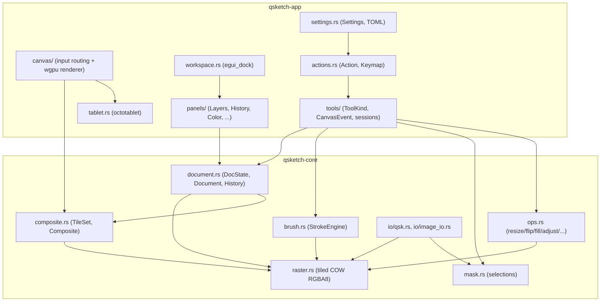
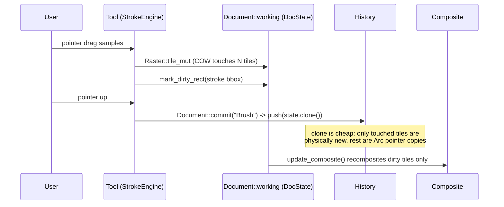

# Architecture

qsketch is split into two crates with a hard boundary between them:

- **`crates/qsketch-core`** — the headless document model: the tiled raster
  store, blend modes and compositor, the brush/stroke engine, selection
  masks, undo history, whole-document operations, clipboard data and the
  `.qsk`/image file formats. Nothing here depends on a GUI toolkit, and it
  has its own unit test suite (see the `#[cfg(test)]` modules in each file).
- **`crates/qsketch-app`** — the `egui`/`eframe`/`wgpu` desktop application:
  window/app lifecycle, the dockable workspace, panels, tools, tablet input
  and the canvas renderer. It depends on `qsketch-core` for everything
  document-related.



## The tiled, copy-on-write raster

A layer's pixels live in a [`Raster`](../crates/qsketch-core/src/raster.rs)
(`crates/qsketch-core/src/raster.rs`): a fixed-size grid of `64x64`
straight-alpha RGBA8 tiles (`TILE = 64`, see `raster.rs`), each an
`Option<Arc<Tile>>`. An empty tile is simply `None`, so sparse layers cost
almost nothing. Cloning a `Raster` clones the `Vec` of `Arc` pointers, an
O(tile-count) but allocation-cheap operation; mutating a tile goes through
`Arc::make_mut`, which copies that one 16 KiB tile the first time it's
touched after a clone and reuses it afterward (`Raster::tile_mut`,
`Raster::tile_ptr_eq`).

This is what makes undo affordable: a [`DocState`](../crates/qsketch-core/src/document.rs)
snapshot (the whole layer stack, at a point in time) is just a shallow clone,
and [`History`](../crates/qsketch-core/src/history.rs) is a plain `Vec` of
these snapshots with a cursor (`history.rs`, capped at `Settings::undo_limit`,
default 100, minimum 2). Only the tiles a stroke actually touched are ever
physically duplicated; everything else in the snapshot is a pointer copy.
`document::dirty_between()` compares two `DocState`s tile-by-tile via
`Raster::tile_ptr_eq` to find exactly which tiles changed across an
undo/redo jump, so only those need recompositing.



## Straight alpha vs. premultiplied

Layer storage and every editing operation in `raster.rs`/`brush.rs`/`ops.rs`
work in **straight alpha** — it is exact for arbitrary-precision blending
math and is what gets written to layer PNGs in `.qsk` files. The
[`Composite`](../crates/qsketch-core/src/composite.rs) that the layer stack
compositor produces, however, is **premultiplied** RGBA8 (`Composite::update`
in `composite.rs`): it's what the GPU wants for a single, correct
alpha-blend against the checkerboard with no separate "unmultiply" step in
the shader. `Composite::to_rgba_straight()` converts back to straight alpha
for export/thumbnails; `Composite::to_rgba_premul()` is the raw GPU-ready
buffer.

Compositing itself (`composite::composite_tile_straight`) walks the visible
layer stack bottom-to-top per 64x64 tile, applying each layer's `BlendMode`
(`blend.rs`; 20 modes, matching the W3C compositing spec and Photoshop for
the shared ones, including the four non-separable Hue/Saturation/Color/
Luminosity modes) and opacity, with a fast path for `Normal`-mode fully
opaque layers. Clipping masks (`LayerProps::clipped`) look up the alpha of
the nearest non-clipped layer below as an extra alpha multiplier.

## Brush engine: flow vs. opacity, coverage, pressure

[`StrokeEngine`](../crates/qsketch-core/src/brush.rs) (`brush.rs`)
implements Photoshop stroke semantics: **flow** is how much paint each
individual dab deposits, and **opacity** is a hard cap on how much a whole
stroke can build up, no matter how many overlapping dabs land on a pixel.
This is tracked with a per-stroke **coverage buffer** — one `f32` per pixel
per touched tile (`StrokeEngine::coverage: HashMap<tile_index, Box<[f32;
TILE_PX]>>`) — accumulated as each dab lands:

```rust
*c += alpha * fall * (1.0 - *c);   // brush.rs, StrokeEngine::dab
```

so coverage saturates toward 1.0 but never exceeds it within one stroke.
`StrokeEngine::apply()` then recomputes each touched pixel from the
**original** (pre-stroke) layer content plus `coverage * opacity`, rather
than blending onto the mutating layer directly — this is why overlapping
dabs in one stroke never build past the opacity cap, and why alpha-locked or
selection-masked painting can be computed as one pass over `(original,
coverage, selection)` instead of accumulating rounding error dab by dab.

Dab spacing is a fraction of brush diameter (`BrushSettings::spacing`);
`StrokeEngine::extend()` walks the input polyline in `spacing_px()`
increments, interpolating position and pressure between samples so fast
mouse/pen motion doesn't leave gaps. Position is exponentially smoothed
(`BrushSettings::smoothing`) before dabbing. Pressure feeds two independent
curves controlled by `pressure_size`/`pressure_opacity`: `radius_for()` scales
the dab radius between `min_size` and full size, and `alpha_for()` scales
flow by pressure. A separate, global pressure-response curve
(`brush::pressure_curve`, exponent from `TabletSettings::pressure_gamma`) is
applied earlier, in the app layer, before samples ever reach `StrokeEngine`.

Dab falloff (`brush::falloff`) gives a 1px anti-aliased rim at the brush
radius and a `hardness`-controlled smoothstep transition inside it; brushes
with `antialias: false` (e.g. the "Pixel" preset) instead get a hard 0/1 cutoff
for Aseprite-style crisp pixels.

## Compositor: dirty tiles → GPU tile uploads

[`TileSet`](../crates/qsketch-core/src/composite.rs) is a bitset over tile
coordinates. Anything that touches pixels — a stroke, a fill, a selection
change, undo/redo — marks the affected tiles dirty on the live
[`Document`](../crates/qsketch-core/src/document.rs) (`mark_dirty_rect`/
`mark_dirty_tiles`/`mark_all_dirty`). `Document::update_composite()` drains
that dirty set and recomposites only those tiles, in parallel across tiles
via `rayon` (`Composite::update`), returning the `TileSet` that actually
changed.

On the app side, `canvas/mod.rs::show()` calls `update_composite()` once per
frame per visible document, then walks the returned dirty set (or every tile,
if the GPU texture was just (re)created or resized —
`render::needs_full_upload`) and builds a list of `TileUpload { tx, ty, data
}` records. These become one `egui_wgpu::Callback` (`canvas/render.rs`)
whose `prepare()` writes each 64x64 tile straight into the document's GPU
texture with `queue.write_texture`, and whose `paint()` draws a single
full-screen quad sampling that texture (`canvas/shader.wgsl`). The shader
maps each output pixel back into document space (inverse of pan/zoom/
rotation/flip), samples the premultiplied texture, and blends it over a
screen-space checkerboard — plus an optional 1px pixel grid above a
configurable zoom threshold.

```mermaid
graph LR
    A["Stroke / fill / undo"] -->|mark_dirty_*| B[Document.dirty: TileSet]
    B -->|update_composite, rayon par_iter| C["Composite (premultiplied tiles)"]
    C -->|dirty tiles only, or all if texture (re)created| D["Vec&lt;TileUpload&gt;"]
    D -->|queue.write_texture per 64x64 tile| E["wgpu Texture (per document)"]
    E -->|shader.wgsl fs_main: inverse view transform + sample| F[Screen]
```

## Input pipeline: pointer/touch → CanvasEvent → tools

`canvas/mod.rs::show()` is the single entry point for canvas input. Each
frame it drains `egui`'s raw input events for the canvas's `Sense::click_and_drag`
response and turns them into a small event enum,
[`CanvasEvent`](../crates/qsketch-app/src/tools/mod.rs) (`Press`/`Drag`/
`Release`/`Hover`/`DoubleClick`/`Cancel`), each carrying a `CanvasInput`
(document-space position, screen position, curved pressure, modifiers,
button). `tools::handle()` routes the event to the active tool's handler
based on `ToolKind` (paint/shape/marquee/lasso/wand/move/crop/eyedropper/
fill/gradient/zoom/hand/rotate), which may start, continue or finish a
`ToolSession` (e.g. `Stroke { engine: StrokeEngine, .. }` for brush/pencil/
eraser).

Pressure arrives from one of two sources:

- **Native pen/touch events**: `egui::Event::Touch { force, .. }` carries a
  0..=1 force value from winit; `canvas/mod.rs` stores it on `state.pen` when
  the dedicated tablet backend isn't active.
- **The optional [`octotablet`](../crates/qsketch-app/src/tablet.rs) backend**
  (`tablet.rs`, `TabletSettings::use_octotablet`, off by default): a
  dedicated `octotablet::Manager` built from the window's raw handles, pumped
  once per frame (`Tablet::pump`). It reports proximity, contact, tilt and
  per-sample pressure through its own event stream (Windows Ink
  RealTimeStylus, Wayland tablet-v2), and — unlike touch-force — can tell a
  stylus's eraser tip from its writing tip
  (`TabletSettings::eraser_tip_switches_tool` temporarily swaps in the Eraser
  tool while the eraser tip is in contact). Samples collected this way are
  queued (`state.tablet_samples`) and replayed as `CanvasEvent::Drag` after
  the normal per-frame event loop, so a fast flick that produced several
  tablet samples in one frame still turns into several dabs, not one.

Either way, raw pressure passes through `AppState::curve_pressure()` (the
`pressure_gamma`/`min_pressure` curve from `TabletSettings`) before reaching
`CanvasInput::pressure` and, downstream, `StrokeEngine`.

## The action/keymap registry

Every user-invokable command — menu items and tool selection alike — is
declared once via the `actions!` macro in
[`actions.rs`](../crates/qsketch-app/src/actions.rs), which generates the
`Action` enum together with its label, `Category` (for menu placement) and
default shortcut string(s). A [`Keymap`](../crates/qsketch-app/src/actions.rs)
resolves key presses to actions (`Keymap::lookup`, preferring the most
specific modifier match), starts from `Action::default_shortcuts()` and is
overridden per-user from `Settings::shortcuts` (an `action id → shortcut
strings` map persisted in `settings.toml`); `Keymap::overrides()` computes
the diff against defaults so only actually-changed bindings are persisted.
See [`docs/SHORTCUTS.md`](SHORTCUTS.md) for the full generated table.

## Settings persistence

[`Settings`](../crates/qsketch-app/src/settings.rs) (`settings.rs`) is one
`serde`-derived struct (general/UI/canvas/tablet/paint sub-structs, keymap
overrides, and the serialized dock layout) round-tripped as TOML via the
`toml` crate. `Settings::path()` resolves the file through
`directories::ProjectDirs::from("dev", "cabbit-labs", "qSketch")`'s
`config_dir()` (see the README for the exact per-platform paths).
`Settings::save()` writes to a `.toml.tmp` sibling and renames it into place
to avoid a torn write; `Settings::sanitize()` clamps out-of-range values
after loading (e.g. a hand-edited or older-version file) instead of failing
to start.

## The dock workspace

[`Workspace`](../crates/qsketch-app/src/workspace.rs) wraps `egui_dock`'s
`DockState<PanelKind>`. `PanelKind` distinguishes the singleton panels
(Tools, Layers, History, Color, Swatches, Navigator, Brushes, Info, Home)
from `PanelKind::Document(DocId)`, one tab per open document. The
`TabViewer` impl (`workspace.rs::Viewer`) dispatches each tab's `ui()` to the
matching module under `panels/` (or `canvas::show()` for documents), routes
document-tab closes through `AppState::close_doc_requests` so unsaved-changes
prompts can intercept them, and never lets the Home tab close. The layout —
including floating panel windows — is serialized to JSON
(`Workspace::to_json`, stripping document tabs, which never survive a
restart) and stored in `Settings::layout`.
